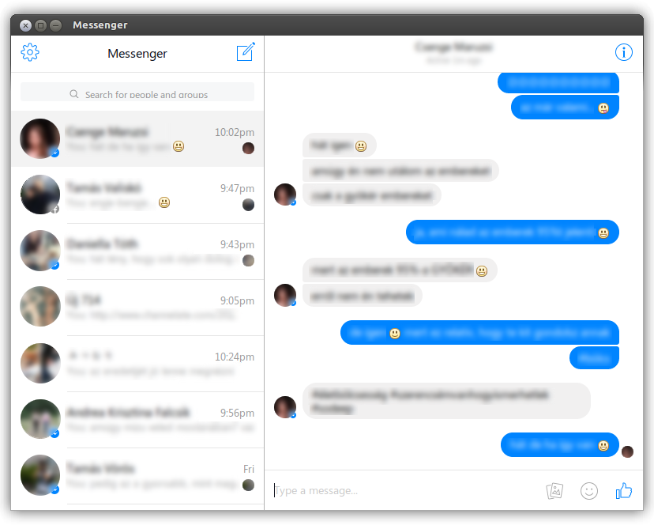

# Messenger
A headless browser window for Facebook's [Messenger.com](https://messenger.com).

## Why?
[Messenger.com](https://messenger.com) is really great if you use mostly only the chat functionality of Facebook. Giving it a headless browser opens a lot of possibilities, like native notifications and better OS integration. That is the main goal of this project.

## Requirements
* python3
* gtk3
* wekbit

## Features
* headless browser
* saves cookies, remembers login credentials (if you check it)
* launcher icon

## TODO
* allow only one instance running (via dbus or GtkApplication)
* native desktop notifications
* inject smooth scrolling and don't break the current javascript scroll events
* attachment download support
* memory leak (?) fix
* Gtk headerbar support
* don't mark messages read if the window is not focused
* launcher quicklist

## Installation
Download the source by cloning or something, then run the install script `INSTALL` as superuser.

## Contribution
Feel free to report bugs, fork the repo, etc. Also I would really appreciate your help if you are great in Javascript and can backtrack how Messenger.com works, so we can modify its behaviour for a better OS integration.

## License
GPLv3
